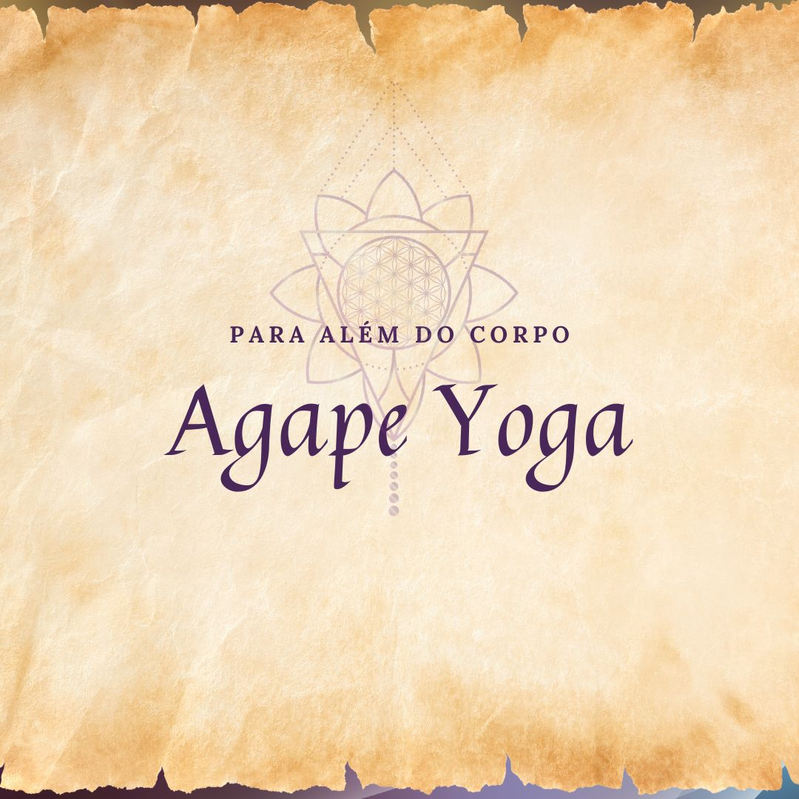

<h1 align="center"> 🌿 Agape Yoga </h1>

Projeto de desenvolvimento web inspirado no meu propósito principal: o <strong>Agape Yoga</strong>, 
um espaço de autoconhecimento, equilíbrio e conexão. 
Aqui, uni o aprendizado em programação com a filosofia do Yoga, trazendo harmonia entre tecnologia e bem-estar.

  <a href="#-tecnologias">Tecnologias</a>&nbsp;&nbsp;&nbsp;|&nbsp;&nbsp;&nbsp;
  <a href="#-projeto">Projeto</a>&nbsp;&nbsp;&nbsp;|&nbsp;&nbsp;&nbsp;
  <a href="#-layout">Layout</a>&nbsp;&nbsp;&nbsp;|&nbsp;&nbsp;&nbsp;

  

## 🚀 Tecnologias

Esse projeto foi desenvolvido com as seguintes tecnologias:

- HTML e CSS
- JavaScript
- Git e Github
- Figma

## 💻 Projeto

O **Agape Yoga** é um projeto em constante evolução, que integra meus estudos de programação 
ao universo do Yoga. A proposta é criar um espaço digital que represente a essência do Agape Yoga, 
mostrando como a tecnologia pode ser aplicada em projetos de autoconhecimento e espiritualidade.

Neste repositório, o foco está no **modo dark/light** e na troca dinâmica de elementos da interface 
(imagens, textos e links) de forma simples e intuitiva, como uma metáfora para os ciclos de luz e sombra que vivemos.

## 🔖 Layout

Você pode visualizar o layout do projeto através [DESSE LINK](https://renatamayra.github.io/agapeyoga/). 

---

Feito com ♥ by Renata Mayra ✨ | Inspirado pelo caminho do Yoga 🌸

